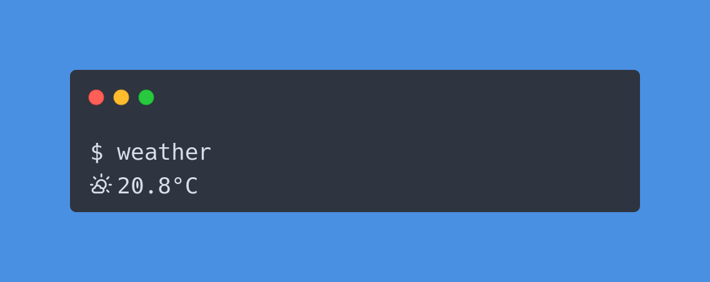

# ⛅Weather

`weather` is a command-line application designed to provide the current weather
forecast for your location. It is excellent for integrating with a status bar,
allowing you to quickly glance at the current weather conditions.

## 🚀 Features

- Configurable icons, colors, and formatting (support for both
  [nerdfonts](https://www.nerdfonts.com/), and unicode)

- Option to specify your location manually or let `weather` determine it
  automatically

- Compatible with multiple weather forecasting APIs (current support for
  [met.no](https://api.met.no/) and
  [openweather](https://openweathermap.org/api))

- Integration with various geocoding APIs (based on latitude-longitude,
  location string, or IP)

- Extensible by design, allowing you to develop your own plugins for
  integration with additional weather forecasting and geocoding APIs, as well
  as custom icon sets.

## 📸 Screenshot



## 📦 Installation

### Binary installation

[Download](https://github.com/jpbruinsslot/weather/releases) a
compatible binary for your system. For convenience, place `weather` in a
directory where you can access it from the command line.

### Via Go

```text
$ go install github.com/jpbruinsslot/weather/cmd/weather
```

## 💻 Usage

When you've installed weather, you can run it by just executing `weather` on
the command line.

```text
$ weather
```

## 🔧 Configuration

When you run `weather` for the first time, it will generate a default
configuration file. This file will be stored in your `XDG_CONFIG_HOME`
directory. To display the configuration file's location, use the `weather
-config-path` command. When modifying the file, you have the option to adjust
the following settings:

### Appearance

#### Icons

By default the unicode icon set is used. However, as it has a limited array of
icons for various weather conditions, an alternative is available by utilizing
[nerd fonts](https://www.nerdfonts.com). Ensure that you have installed or
patched a font following the [installation
manual](https://github.com/ryanoasis/nerd-fonts). Within the configuration
file, you can modify the icon_type to nerd-fonts.

```javascript
{
    "icon_type": "nerd-fonts"
}
```

If you prefer to utilize custom icons or override specific icons, you can
update the values located in the `icons` field. For instance:

```javascript
{
    "icons": {
        "celsius": "°C"
    }
}
```

Click [here](./icons/icons.go) to get an overview all the icons that you can
customize.

#### Formatting

The formatting of `weather` is controlled by the `format` value. It leverages
the [Go templating syntax](https://pkg.go.dev/text/template) to manage
formatting. You can use the following values and arrange them to suit your
preferences:

| Field                | Description                                               |
| -------------------- | --------------------------------------------------------- |
| `{{ .Temperature }}` | The temperature of the weather forecast                   |
| `{{ .Units }}`       | The units of the weather forecast (Celsius or Fahrenheit) |
| `{{ .Icon }}`        | The icon of the weather forecast                          |
| `{{ .Rain }}`        | Rain icon indicator                                       |

Default:

```
{{if .Rain}}{{.Rain}} {{end}}{{.Icon}}  {{printf `%.1f` .Temperature}}{{.Units}}
```

#### Colors

You're also able to choose from variety of colors. At the moment this is
limited to the basic ANSI color codes.

| Color                   |
| ----------------------- |
| `{{ .Colors.Black }}`   |
| `{{ .Colors.Red }}`     |
| `{{ .Colors.Green }}`   |
| `{{ .Colors.Yellow }}`  |
| `{{ .Colors.Blue }}`    |
| `{{ .Colors.Magenta }}` |
| `{{ .Colors.Cyan }}`    |
| `{{ .Colors.White }}`   |

To incorporate colors, modify the formatting of the `format` field by adding
color to specific parts of your output. Begin a color section by specifying a
color and conclude it with `{{.Colors.Reset}}`.

For example if you only want to color the rain indicator icon to be blue:

```
{{if .Rain}}{{.Colors.Blue}}{{.Rain}}{{.Colors.Reset}} {{end}}{{.Icon}}  {{printf `%.1f` .Temperature}}{{.Units}}
```

### Location

`weather` will initially attempt to retrieve the latitude and longitude specified
in the `latitude` and `longitude` fields. In the absence of these coordinates, it
will resort to the location string provided in the location field. Finally, if
neither of these options is available, it will attempt to determine the
location based on the machine's IP address.

The recommended and simplest method is to specify your location with the
`latitude` and `longitude` fields. The other two options require API access
with a key to those services

#### Latitude / Longitude

If you wish to define your latitude and longitude, you can modify the
`latitude` and `longitude` fields. This will take precedence over any other
location specification. Simply update the values of the `latitude` and
`longitude` fields in the configuration file.

```javascript
{
    "latitude": 52.1015441,
    "longitude": 5.1779992
}
```

#### Location string

By utilizing the [Google Maps API](https://maps.googleapis.com) you can specify
a location string. This will retrieve the latitude and longitude of the
provided location string.

To do this, update the value of `location` in the configuration file to the
desired location string.

```javascript
{
    "location": "Amsterdam, The Netherlands"
}
```

To enable this functionality, you must provide a Google Maps API key in the
`geocoder` section of the configuration file.

```javascript
{
    "geocoder": {
        "google": {
            "api_key": "your-api-key",
            "enabled": true
        }
    }
}

```

#### IP address

To determine the location of your machine based on the IP address, you can
utilize the IP Geolocation service from
[ipgeolocation.io](https://ipgeolocation.io). Make sure to specify this service
in the configuration file to enable IP-based geolocation.

To utilize this feature, it is necessary to provide an ipgeolocation.io API key
in the `geocoder` section of the configuration file.

```javascript
{
    "geocoder": {
        "ipgeolocation": {
            "api_key": "your-api-key",
            "enabled": true
        }
    }
}

```

### Forecaster

### MET

By default `weather` uses the [MET](https://api.met.no/) weather forecasting
API. If you want to use this API you don't need to change anything in the
configuration file.

### OpenWeather

If you want to use [OpenWeather](https://openweathermap.org/api) API you need
to specify an API key in the `forecaster` section of the configuration file.

```javascript
{
    "forecaster": {
        "openweather": {
            "api_key": "your-api-key",
            "enabled": true
        }
    }
}

```

### Other configuration options

The configuration file allows you to modify various other settings. The
following table provides an overview of all the available options.

| field      | description                                    | default               |
| ---------- | ---------------------------------------------- | --------------------- |
| `units`    | choose either imperial or metric               | `{"units": "metric"}` |
| `interval` | set the interval in seconds to use cached data | `{"interval": 60}`    |

## 📖 License

This project is licensed under the MIT License - see the [LICENSE](./LICENSE)
file for details.
